# Train and Deploy Models with Azure ML

## Table of Contents
- [Problem Statement](##problem)
- [Data Set](##dataset)
    - [Task](###task)
    - [Access](###access)
- [Automated ML](##automl)
    - [Result](##automl_result)
- [Hyperparameter Tuning](##hyperdrive)
    - [Result](##hyperdrive_result)
 - [Model Overview](##model_overview_suggestions)
 - [How to improve](##improve)
 - [Model Deployment](##deployment)
 - [screen Recording](##recording) 
 - [Standout Suggestions](##standout)

# House Sales in King County USA <a name="problem"></a>

In This Project i have Considered a Regression problem, it's a process of predicting a continuous value instead of discrete value given an input data, i have used two different techniques to train the model , one is using the AutoML which will trigger the training on multiple different models and second one using Hyperdrive configuration with single model

## Project Set Up and Installation
I don't have any specific environment that needs to be setup 

## Dataset <a name="dataset"></a>

### Overview
In this project i have considered housing sales data set of king county, i have found this data set on [kaggle](https://www.kaggle.com/harlfoxem/housesalesprediction) , this data contains homes sold between may 2014 to may 2015, it requires minimal data cleaning and has an understandable list of variables, this enables me to focus more on required configuration to work with AzureML 

### Task <a name="task"></a>
My Objective is to build a prediction model that predicts the housing prices from the set of given house features like , number of bedrooms, number of bathrooms , i will be perfomring this using Regression Task 

### Access
I have downloaded the housing sale dataset from kaggle first and uploaded the csv file to datastore , once that dataset is available in Azure i have used the below code to access the data from the datastore 
```
key = "house_sales"
description_text = "house sales prediction dataset"

if key in ws.datasets.keys():
    
    dataset = ws.datasets[key]

df = dataset.to_pandas_dataframe()
df.describe()
```

## Automated ML <a name="automl"></a>
While setting up the AutomL run we first need to define the automl configuration which has different parameters like task type whether it's regression or classification and label column, primary metric, and number of cross validations 

For this experiment i have selected regression as the task, Price as the label column, and for regression task normalized mean absolute error actually generalizes the model better so i have selected that and i have defined the timout minutes based on the common practices 
here are the automl settings i have selected for the automl run 

from the below list of settings i have selected verbosity as logging info , it defines verbosity level of writing to log file and i have selected defaulted value of INFO which will log all the info 

i have also selected the enable early stopping to be true because i would like the model to stop training if the performance of the previous iterations is better

i have selected the experiment timeout to be 3 hours as it will be more than enough to complete this task and also for each iteration time out has been set as 10 minutes as that will be good enough to complete the training for each iteration 

i have enabled the featurization to Auto as the data is pretty much in good shape and need very few changes , otherwise we can define a custom featurization when the data is messy , i have selected the number of cross validations to be 5 as a random selection , which means for each model training the cross validation is performed 5 times at different splits on dataset 
```
automl_settings = {
    "iteration_timeout_minutes": 10,
    "experiment_timeout_hours" : 0.3,
    "enable_early_stopping": True,
    "primary_metric" : 'normalized_mean_absolute_error',
    "featurization": 'auto',
    "verbosity": logging.INFO,
    "n_cross_validations": 5
}

# TODO: Put your automl config here
automl_config = AutoMLConfig(
    task = 'regression',
    debug_log = 'automl_reg_errors.log',
    training_data = x_train,
    label_column_name = "price",
    **automl_settings
)

```

Next we submit the automl run which we can monitor using run widgets in notebook or also azure ML studio UI , below are the screen shots of the progress 
```
remote_run = experiment.submit(automl_config, show_output = True)

RunDetails(remote_run).show()
remote_run.get_status()
remote_run.wait_for_completion()
```
### Screen shot of the run details widget for automl

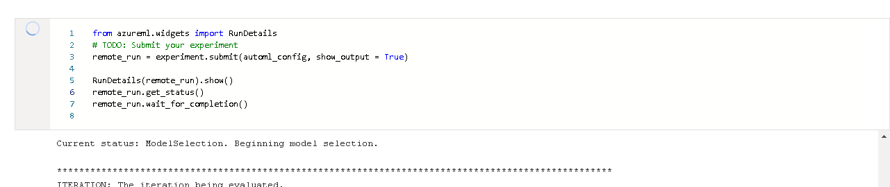

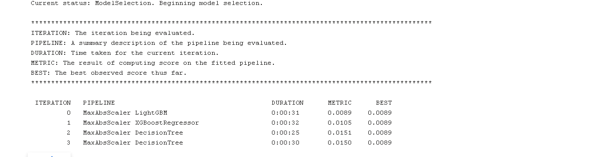

### Results <a name="automl_result"></a>

Best automl model is voting ensemble with nomalized mean absolute value of 0.0089 and mean absolute error of 68316 and some of the parameters of the model as boositng type , learning rate, max_depth of the tree, number of estimators and the model that is used is LigbtGBMregressor we could improve the model by training with more data and adding different types of data which helps the model to generalize better later 


```
best_run,fitted_model = remote_run.get_output()
print(best_run)
print(fitted_model.steps)


Run(Experiment: Avinash-AutoML,
Id: AutoML_d8b08989-fcef-4c17-9747-bbd0f27cd685_25,
Type: None,
Status: Completed)
[('datatransformer', DataTransformer(enable_dnn=None, enable_feature_sweeping=None,
                feature_sweeping_config=None, feature_sweeping_timeout=None,
                featurization_config=None, force_text_dnn=None,
                is_cross_validation=None, is_onnx_compatible=None, logger=None,
                observer=None, task=None, working_dir=None)), ('prefittedsoftvotingregressor', PreFittedSoftVotingRegressor(estimators=[('0',
                                          Pipeline(memory=None,
                                                   steps=[('maxabsscaler',
                                                           MaxAbsScaler(copy=True)),
                                                          ('lightgbmregressor',
                                                           LightGBMRegressor(boosting_type='gbdt',
                                                                             class_weight=None,
                                                                             colsample_bytree=1.0,
                                                                             importance_type='split',
                                                                             learning_rate=0.1,
                                                                             max_depth=-1,
                                                                             min_child_samples=20,
                                                                             min_child_weight=0.001,
                                                                             min_split_gain=0.0,
                                                                             n_estimators=100,
                                                                             n_jobs=1,
                                                                             num_leaves=31,
                                                                             objective=None,
                                                                             random_state=None,
                                                                             reg_alpha=0.0,
                                                                             reg_lambda=0.0,
                                                                             silent=True,
                                                                             subsample=1.0,
                                                                             subsample_for_bin=200000,
                                                                             subsample_freq=0,
                                                                             verbose=-1))],
                                                   verbose=False))],
                             weights=[1.0]))]

```
### Screen shots of the Best model and the steps and how it performed for automl

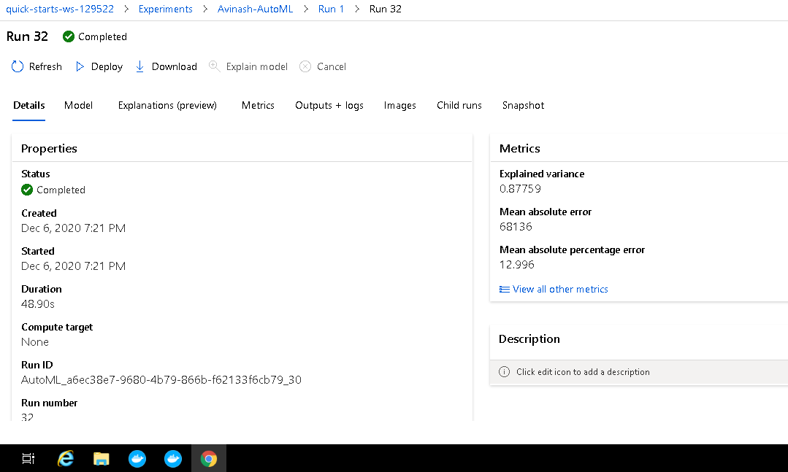

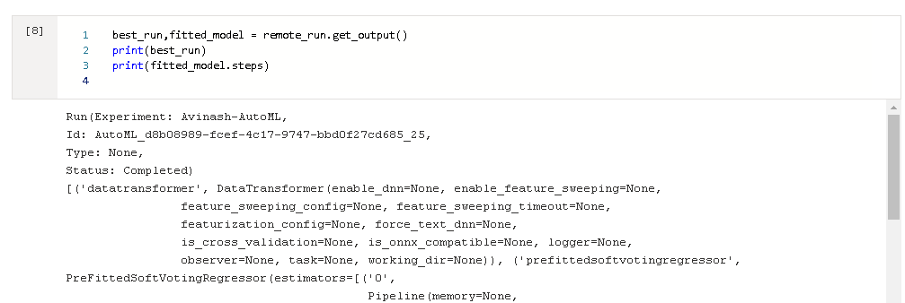

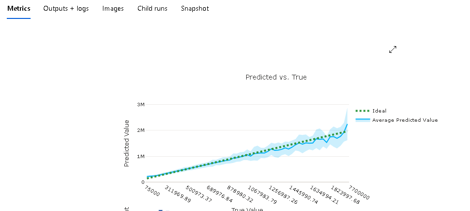

## Hyperparameter Tuning <a name="hyperdrive"></a>

I have selected the randomforest regressor which is a tree based model for hyperparameter tuning , this model is simple yet powerful when compared with other Tree based models. It provides higher accuracy through cross validation , it will handle the missing values and maintains accuracy of a large portion of the data

I have defined 3 different hyper parameters for the model and implemented them usig random parameter sampling to find the best model 

1. n_estimators : it defines the number of trees in the forest , i have tuned it for 3 different values 100, 120, 140
2. Max_depth : the maximum depth of tree , if we select none then nodes are expanded until all leaves are pure , i have defined 3 values as 3, 5, 8
3. Min_samples_split : the minimum number of samples required to split an internal node , value defined for this are 2, 4, 8

```
param_sampling = RandomParameterSampling({
    "--n_estimators": choice(100,120,140),
    "--max_depth": choice(3,5,8),
    "--min_samples_split": choice(2,4,8)
})
```


### Results <a name="hyperdrive_result"></a> 

Best model has the Mean absolute error of 88124 and the accuracy of the model is 82 % , some of the parameters of the model are number of estimators and for the best model the value is 100 , seocnd parameter is maximum depth and best value from random parameter sampling is 8 and also minimum samples split wfor which the best value is 2 

I think we can improve this model further by applying more hyperparameters like min_samples_leaf, n_jobs, and also by adding more data to the training data set , we can also perform feature engineering on date fields to split them into multiple fields as well 

```
run = experiment.submit(hyperdrive_run_config,show_output = True)
RunDetails(run).show()
run.get_status()
run.wait_for_completion()
```

### Run widget details showing progress 
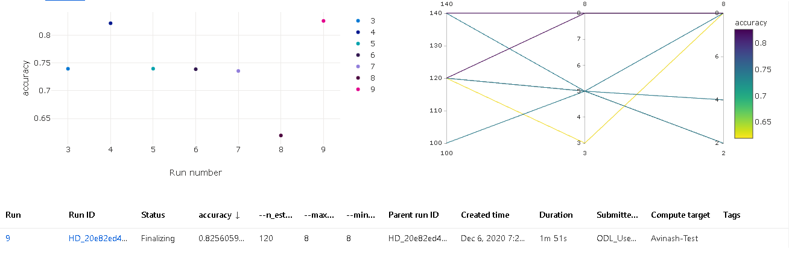

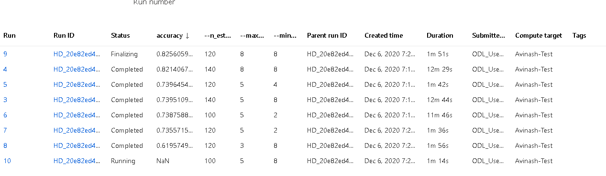

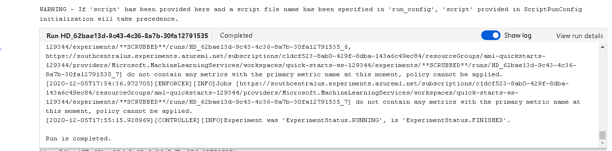

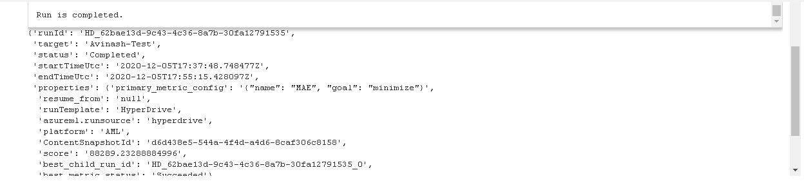

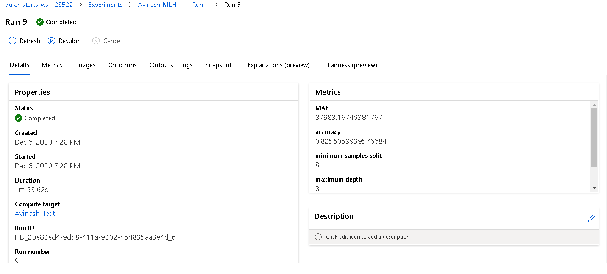

### Best run and the id

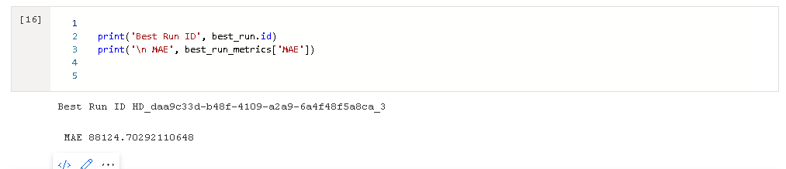

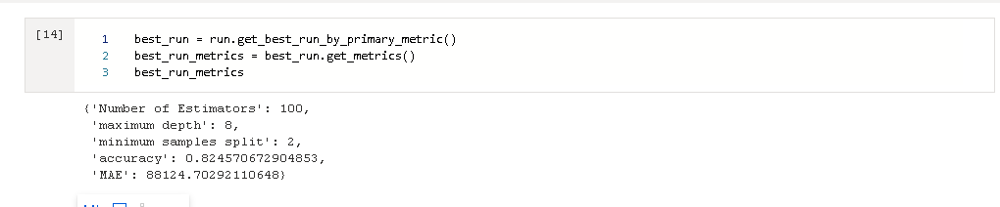

### Best model registered 

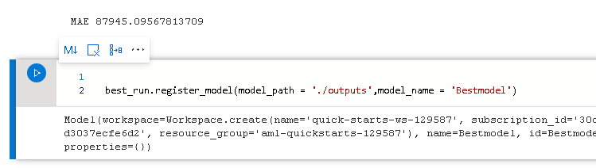

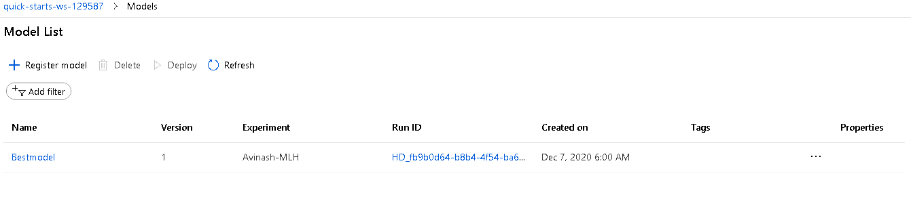

## Overview of two models <a name="model_overview_suggestions"></a>

for the experiment of Hyperdrive the best performing model has an MAE of 88124 and the hyperparameters of the model for randomforest regressor are n_estimators is 100, min samples split as 8 and maximum depth of 8 as well 

for the experiment of Automl the best performing model has an MAE of 68316 and some of the parameters of the model as boositng type , learning rate, max_depth of the tree, number of estimators and the model that is used is LigbtGBMregressor we could improve the model by training with more data and adding different types of data which helps the model to generalize better later 

when i compare the both experiments automl model has less MAE and i have selected that metric as my primary to minimize , as the automl model has better MAE i have used that model to deploy it 


## How to improve model <a name="improve"></a>

when it comes to suggestions on improving this project, i think it will make it better if we can create our own algorithm and bring it into Azure and deploy it 
as most of the real case scenario usually they train their model on local model and then register it in Azure using Docker and bring your own model method 

that will also give a chance to train any kind of models from deep learning to RNN's using tensorflow and Pytorch 

and also it will make the project better if i can train the hyperdrive model with different other configurations like grid sampling and different early termination policy , we can also make the training as pipeline , that way when the new data comes in we can clearly re train the pipeline without building from start 

with the current set up the data we have for training can be more and i would like to improve it by gatehring more data and creating more feature using feature engineering as well and also deploying the final model as rest endpoint for inference through a UI where you can input the details and once you submit the output will be returned 


## Model Deployment <a name="deployment"></a>

Best model when we compare the mean absolute error of two methods is Voting ensemble which is trained using automl

First step in deploying the mode is identifying the best run and best fitted model , we can register the model using below command 
once the model is registered we can define the inference configuration which is used to make calls to end point , we can add a script as input to inference 
and next we define the web service with deployement configurations like number of CPU/GPU's , memory and tags and we also need to define the environment variables which helps have the same configurations and also install the necessary packages on docker image

Next step is to deploy the model using deploy method , below is the method that can deploy the code and also screen shot of the endpoint 

once the endpoint is deployed and active , we can make a call to the end point using Http request for inference , i have prepared the data into json format initially to pass as the input to the http request , second is get the keys and service URI , key is used as authorization in the header to call the while posting the data to service URI , once we have all the data in json , service URI and key we can make a call by sending the data in application/json format 

```
model = best_run.register_model(model_path = './outputs',model_name = 'house_sales1')

best_run.download_file(constants.CONDA_ENV_FILE_PATH, 'myenv.yml')
myenv = Environment.from_conda_specification(name="myenv", file_path="myenv.yml")


inference_config = InferenceConfig(entry_script="scoring.py",environment=myenv)

aci_config = AciWebservice.deploy_configuration(
    cpu_cores=1,
    auth_enabled=True,
    memory_gb=1,
    tags = {'name':'housing sales'},
    description='housing sales model'
)

service = Model.deploy(workspace=ws,
                        name = 'house-sale',
                        models= [model],
                        inference_config=inference_config,
                        deployment_config=aci_config
)

service.wait_for_deployment(True)
print(service.state)

```
### Deployed Model endpoint 

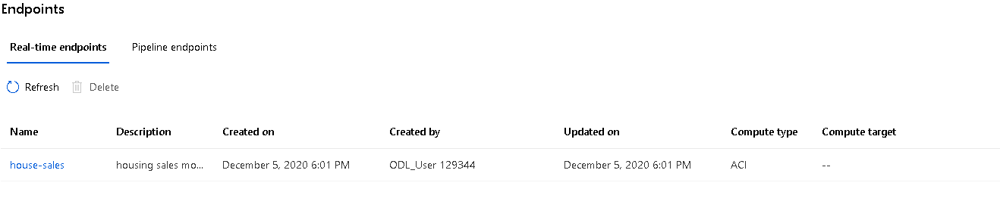

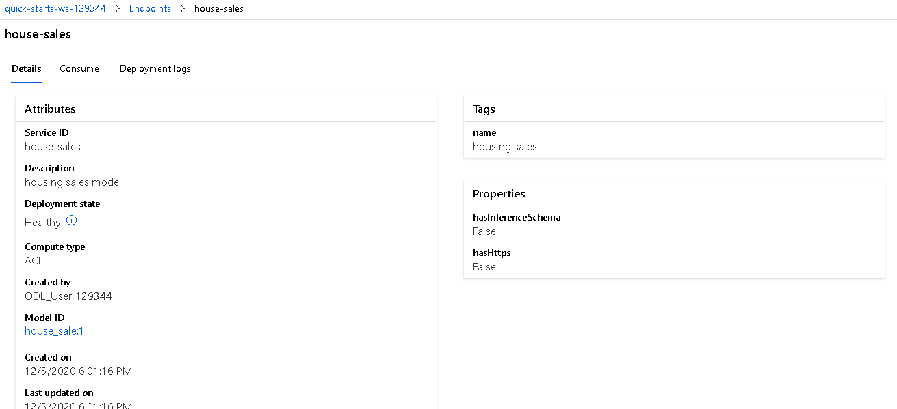

## Screen Recording <a name="recording"></a>
[Screen Cast](https://youtu.be/o7Kw6eYpD8M)

## Standout Suggestions

I have faced few problems with virtual enviroment , i would suggest it's better to have a different kind of structure 
becuase of the slowness of the virtual lab it was difficult the train a model with huge dataset it would be great if you can define the list of datasets to choose from in the future which will be compatible with automl trianing 
